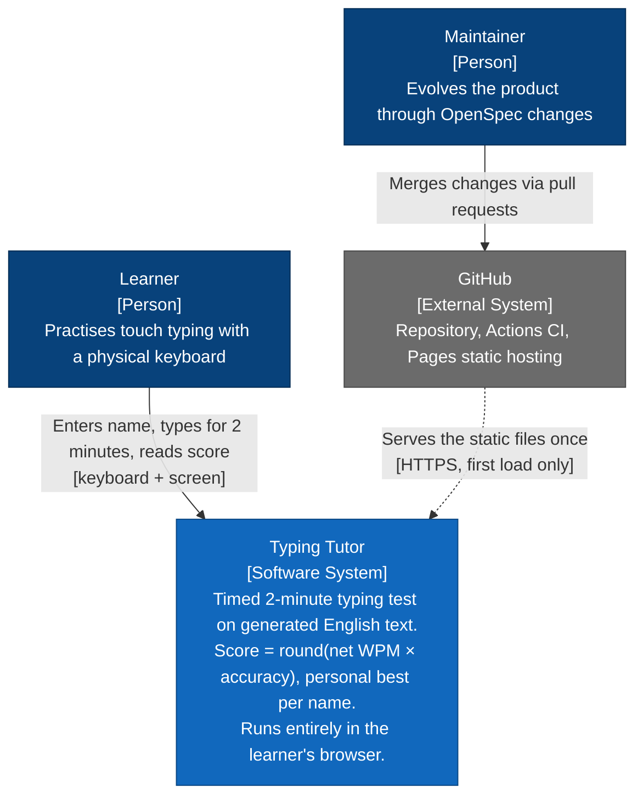
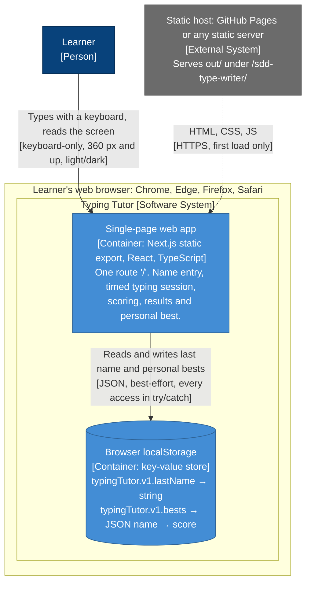
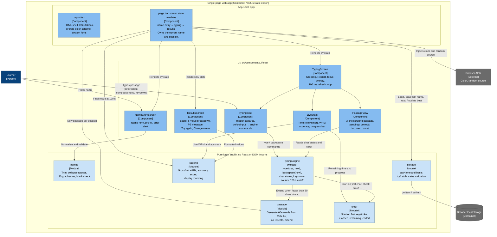
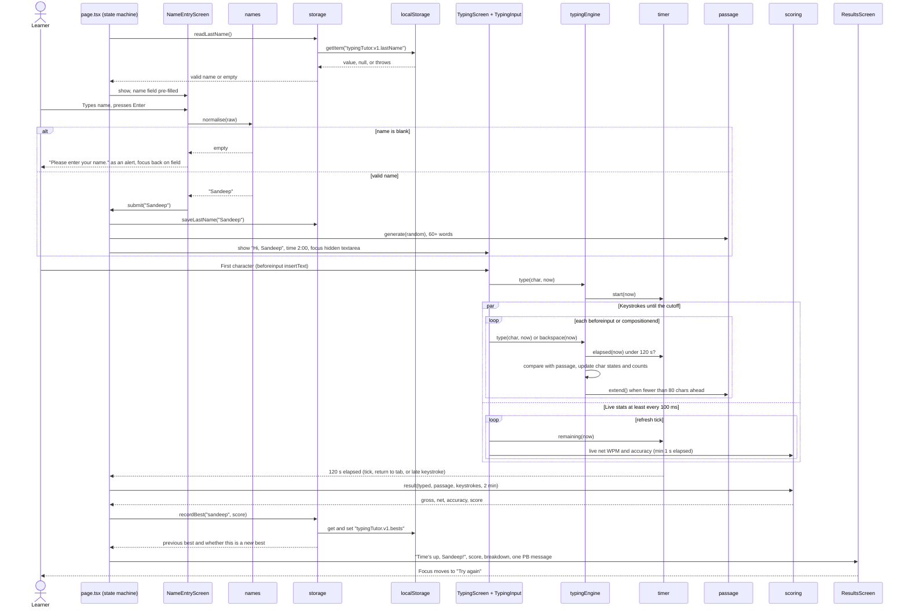
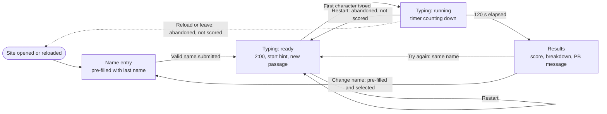
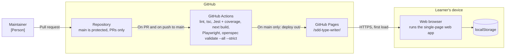

# Typing Tutor — C4 Architecture Diagrams

> Derived from [`docs/requirements-backlog.md`](../requirements-backlog.md) and ADRs
> [0001](../adr/0001-nextjs-static-export-github-pages.md), [0002](../adr/0002-input-capture-beforeinput.md),
> [0003](../adr/0003-tooling-and-ci.md). No application code exists yet, so these diagrams describe the
> **intended** architecture. Update them when an OpenSpec change alters a boundary.
>
> Notation: hybrid C4. The levels are strict C4 (context → container → component), drawn in plain Mermaid
> with `[type: technology]` tags. The dynamic, screen-state and deployment views are supporting diagrams.
> The code level is left out on purpose: each change's `design.md` lists the `src/lib` function signatures.

## 1. System context

Who uses the typing tutor, and which outside systems it depends on.

- **Boundary:** everything the learner does happens inside the Typing Tutor, in the browser. GitHub only
  delivers files. After the first load there are no network requests, and no fonts or code are fetched from third-party or CDN origins.
- **Not in the picture on purpose (out of scope for v1):** backend, accounts, global leaderboards,
  analytics, score history. None of these may appear in later diagrams without a new ADR.
- The learner needs no account. Their identity is just a name they type.

## 2. Containers

The runnable parts and data stores inside the system boundary.

- **Single-page web app:** the only container we build. A static export with no API routes, server
  actions or middleware (ADR-0001). All assets resolve through `basePath`.
- **localStorage:** provided by the browser, but shown as a data store because the app depends on its
  two keys. If it is missing, blocked or holds corrupt data, the app treats the value as absent and keeps working.
  Nothing else is stored: no session history and no in-progress session.
- **Static host:** interchangeable. The only requirement is serving plain files, including under a
  sub-path.

## 3. Components: single-page web app

The inside of the one container, split into an app shell, React UI, and pure logic that has no React or
DOM imports.

- **Dependencies point one way:** UI → `src/lib`. The `src/lib` modules never import React or the DOM. Time and
  randomness are injected, so the whole rule set (cutoff, keystrokes, scoring, storage fallbacks) can be unit-tested
  without a browser (≥ 90 % line coverage, ADR-0003).
- **`typingEngine` is the single source of truth** for what was typed (ADR-0002). `TypingInput` only
  translates DOM events into `type`/`backspace` commands. `PassageView` and `LiveStats` only read engine state.
- **`storage` is the only module that touches localStorage.** It hides blocked storage and corrupt values from everything else.
- **`page.tsx` owns transitions.** At the end of a session it takes the final numbers from `scoring`, updates the best through
  `storage` and passes both to `ResultsScreen`.

### Capability → component map

| Capability | Components | Built in change |
|---|---|---|
| user-identity | `NameEntryScreen`, `names`, `storage` (lastName), `page.tsx` (Change name) | 3, 6 |
| typing-session | `typingEngine`, `timer`, `passage`, `TypingScreen`, `TypingInput`, `PassageView`, `LiveStats` | 4, 5 |
| scoring | `scoring`, `storage` (bests), `ResultsScreen` | 2, 6 |
| web-platform | `layout.tsx`, build config, CI/deploy workflow, a11y attributes across all UI components | 1, 7 |

## 4. Dynamic: one complete session

From opening the site to the results screen, including the error path for a blank name.

## 5. Supporting view: screen states

`page.tsx` is a single route with one state machine (ADR-0001). The browser Back button leaves the site.

## 6. Deployment

- CI blocks merges that fail any check. Only `main` deploys (ADR-0003).
- Locally, the same `out/` folder is checked with `npx serve out`. Opening it from `file://` is not supported (ADR-0001).

## Assumptions

- The component names under `src/components` (`NameEntryScreen`, `TypingScreen`, `PassageView`,
  `TypingInput`, `LiveStats`, `ResultsScreen`) are proposals. The ADRs fix only the `src/lib` module names.
- `page.tsx`, not `ResultsScreen`, computes the final result and updates the personal best, so the
  results screen stays presentational.
- `TypingScreen` owns the refresh loop of at most 100 ms that drives `LiveStats` and detects the 120 s end with no keystroke.
- localStorage is drawn as a container even though the browser provides it, because the app depends on its keys.

## Open questions

1. **Ending while the tab is hidden:** background tabs slow down timers. Should the end-of-session check
   also run on `visibilitychange`/`focus`, so results appear right away on return (scenario "Tab hidden
   during a session")? Or is the next refresh tick after return good enough?
2. **Offline after load:** Next.js may split code into chunks and load them lazily (for example, results
   screen code). Do we need a build check that no chunk is fetched after first load, to meet "Offline
   after load: every feature keeps working"?
3. **Engine state shape:** will `typingEngine` return new immutable state per command (easy to use from React)
   or be a mutable object read on each tick (cheaper at high WPM)? This affects how `PassageView`
   re-renders 60+ words of spans.
