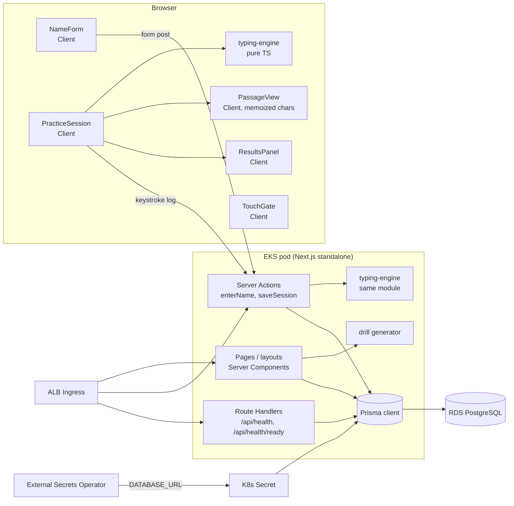

# Design

## Context

The repository is empty apart from OpenSpec; this change builds the whole application and its infrastructure. See `proposal.md` for motivation and scope, and `specs/` for the required behavior. The stack (Next.js App Router, TypeScript, Tailwind, Prisma/PostgreSQL on RDS, EKS via Helm, Terraform, GitHub Actions) is fixed by project conventions. This document covers the decisions the specs leave open.

Constraints that shape the approach:
- Keystroke feedback must render in under 16 ms (`typing-session`).
- Metrics must be recalculated on the server rather than trusted from the browser (`typing-metrics`).
- Pods must be stateless and survive rolling deploys with no failed requests (`platform-operations`).

## Goals / Non-Goals

**Goals:**
- One pure TypeScript typing engine, used by the browser for live feedback and by the server to recalculate metrics, so the two can never disagree.
- A single deployable Next.js app: one image, one Helm chart, one database.
- Initial infrastructure that can be recreated from code (Terraform + Helm) for `staging` and `prod`.

**Non-Goals:**
- Streaming keystrokes to the server while the user types.
- Offline mode, PWA, or service workers.
- A cache layer (Redis) or CDN-specific tuning; add these only if measurements call for it.
- Multi-region deployment, or an analytics/event pipeline.

## Architecture



**Server Components:** root layout, `/` (name entry shell, or redirect when a user is remembered), `/practice` and `/practice/drill` (shells that load the passage or generated drill and the user's personal best), `/progress` (history, trends, weakest keys, all read on the server).

**Client Components:** `NameForm` (inline validation, progressive enhancement over the Server Action), `PracticeSession` (engine, input capture, timer, pause overlay), `PassageView`, `ResultsPanel` (save status, retry, personal best badge), `TouchGate`, `LiveStats`.

**Routes:** `/`, `/practice`, `/practice/drill`, `/progress`, `/api/health`, `/api/health/ready`. Results appear inline in `/practice` after completion, so session state never has to travel through a URL.

**Module layout:**
```
src/
  lib/typing-engine/   # pure TS: state machine, metrics, key stats, log replay (no React, no I/O)
  lib/identity/        # name normalization + validation (shared by client and server)
  lib/drills/          # weak-key drill generator + bundled word list
  lib/passages/        # versioned passages.json + picker
  server/              # prisma client, repositories, server actions, env, logger
  app/                 # routes, layouts, Server/Client Components
prisma/                # schema.prisma, migrations/
deploy/helm/type-writer/  infra/terraform/  .github/workflows/
```

## Decisions

### D1. A shared, pure typing engine with server replay
The engine is a state machine (`idle → running ⇄ paused → completed`) driven by events: `char(ch, t)`, `backspace(t)`, `pause(t)`, `resume(t)`, `reset`. It records an event log with active-time timestamps (`t` in ms since the first keystroke, paused time excluded, measured with `performance.now()`). On completion the browser sends `{clientSessionId, passageRef, log}`. The server replays the log through the same engine to get every stored metric and per-key stat.
- *Alternative: send metrics from the browser.* Rejected by the `typing-metrics` spec.
- *Alternative: stream each keystroke to the server.* Adds latency, server-side state per session, and conflicts with stateless pods.
- *Trade-off:* the server cannot verify the browser's timestamps. It checks the log instead: timestamps never decrease, replay reaches completion, at most 4 × passage length events, and the plausibility bounds (≥ 1 s, ≤ 300 gross WPM).

### D2. Keystroke rendering under 16 ms
`PassageView` renders the passage once as one memoized `<Char>` per character (at most 400). The engine lives in an external store read with `useSyncExternalStore`, and each `<Char>` subscribes only to its own index's state. A keystroke re-renders two or three characters (the changed one and the old and new cursor), not the whole passage. `LiveStats` (timer, live Net WPM) updates on a 250 ms interval, separate from keystrokes. States are shown with `data-state` attributes styled by Tailwind (color plus underline or strike, so feedback never relies on color alone).
- *Alternative: a `useState` array for the whole passage.* Simpler, but every keystroke diffs all 400 nodes; kept as a fallback if profiling shows no gain.
- *Alternative: direct DOM updates.* Fastest, but bypasses React and is harder to test with RTL.
- *Verification:* a Playwright performance test types a 400-character passage and asserts p95 time from input event to paint is under 16 ms using the Performance API.

### D3. Input capture with `beforeinput`
A visually hidden `<textarea>` (`autocomplete/autocorrect/autocapitalize=off`, `spellcheck=false`) holds focus. `beforeinput` handles characters and is cancelled for `insertFromPaste` and `insertFromDrop`, which shows the paste notice. `keydown` handles Backspace and Escape. IME composition is ignored until `compositionend`. `blur` and `visibilitychange` send `pause`, and the next key press sends `resume` and is not entered as a character.
- *Alternative: `keydown` only.* Mishandles dead keys and some layouts' shifted characters.

### D4. Identity: normalized name key plus a remembered-user cookie
`lib/identity` normalizes a name (NFC, trim, collapse whitespace) and validates it against the `user-identity` rules. The lookup key is `nameKey = lowercase(normalized)`. `enterName` upserts by `nameKey`, keeping the original `displayName`, and sets the cookie `tw_uid=<user uuid>` (`HttpOnly`, `SameSite=Lax`, `Secure`, 1 year). Server Components read the cookie, so a returning user is greeted with no flash of the name form. An unknown or deleted uuid is treated as "not remembered".
- *Alternative: `localStorage`.* Server Components cannot read it, so the page would flash the name form and need client-side redirects.
- *Alternative: a signed session token.* Adds no protection, because entering the name grants the same access by design.

### D5. Server Actions for writes, Server Components for reads, Route Handlers only for health
Writes (`enterName`, `saveSession`) are Server Actions; every input is parsed with Zod, and the request body limit is set to 64 KB. Reads (history, trends, weakest keys, personal best) run in Server Components through small repository functions. Health checks are Route Handlers because Kubernetes and the ALB call them as plain HTTP.
- *Alternative: a REST API for everything.* Adds a client data layer the MVP does not need; it can be added later for a mobile client.

### D6. Idempotent saves
`PracticeSession` creates `clientSessionId` (UUID v4) when the session starts. `Session` has a unique constraint on `(userId, clientSessionId)`. `saveSession` inserts with `ON CONFLICT DO NOTHING` and returns the existing row, so retries never create duplicates. The browser keeps the log in memory until the save succeeds, so a retry needs no retyping.

### D7. Passages and the drill word list are bundled files
The passage library is a versioned `passages.json` with stable string ids and length/charset checks in a unit test. The weak-key word list (about 5,000 common English words) is bundled the same way. Each session stores a `passageText` snapshot, so drills (which have no library id) and future passage edits never break history.
- *Alternative: a `Passage` table.* Allows edits without a deploy, but needs seeding in every environment and gives no v1 benefit.

**Drill generation:** pick words containing any weak key and shuffle them with a seeded RNG (deterministic in tests) until 100–400 characters. Weak keys that are digits or punctuation, which rarely appear inside words, are attached to the word (e.g. `quiz;`) so every word still contains a weak key.

### D8. Trends as server-rendered SVG
The Net WPM and accuracy trend is a small hand-built SVG line chart rendered on the server, followed by a `<table>` with the same data (visually collapsed into a `<details>`) as its text alternative.
- *Alternative: Recharts or Chart.js.* Adds about 100 KB of client JS for one chart.

### D9. Configuration and logging
`src/server/env.ts` parses `process.env` with Zod. It runs from Next.js `instrumentation.ts` `register()` at startup; if validation fails it logs only the missing key names and exits with code 1. Logs use `pino` as one-line JSON to stdout, with `redact` paths for `DATABASE_URL`, `*.password`, and `connectionString`. Prisma errors are mapped to categories before logging.

### D10. Graceful shutdown and readiness
On `SIGTERM` the process sets a `shuttingDown` flag (process-level, not user state) so `/api/health/ready` returns 503, then lets in-flight requests drain. The Next.js standalone server's drain behavior is checked in a task. If it does not wait for in-flight requests, a thin custom `server.js` wraps it and calls `server.close()` with a 25 s timeout. Kubernetes adds a `preStop` sleep of 10 s so the ALB deregisters the pod before it stops accepting connections.

## Data Model

```prisma
model User {
  id          String    @id @default(uuid()) @db.Uuid
  displayName String    @db.VarChar(30)
  nameKey     String    @unique @db.VarChar(30)
  createdAt   DateTime  @default(now())
  sessions    Session[]
}

model Session {
  id                String       @id @default(uuid()) @db.Uuid
  userId            String       @db.Uuid
  user              User         @relation(fields: [userId], references: [id], onDelete: Cascade)
  clientSessionId   String       @db.Uuid
  passageId         String?      @db.VarChar(64)   // null for drills
  passageText       String       @db.VarChar(400)
  isDrill           Boolean      @default(false)
  completedAt       DateTime     @default(now())
  elapsedMs         Int
  typedChars        Int
  totalKeystrokes   Int
  correctKeystrokes Int
  totalErrors       Int
  uncorrectedErrors Int
  grossWpm          Decimal      @db.Decimal(6, 2)
  netWpm            Decimal      @db.Decimal(6, 2)
  accuracy          Decimal      @db.Decimal(5, 2)
  keyStats          SessionKeyStat[]

  @@unique([userId, clientSessionId])
  @@index([userId, completedAt(sort: Desc)])
  @@index([userId, netWpm(sort: Desc)])
}

model SessionKeyStat {
  sessionId String  @db.Uuid
  session   Session @relation(fields: [sessionId], references: [id], onDelete: Cascade)
  key       String  @db.VarChar(1)   // letters stored lowercase
  attempts  Int
  errors    Int

  @@id([sessionId, key])
}
```

- **Personal best** is `MAX(netWpm)` over the user's sessions (served by the index), not a separate column, so concurrent saves cannot leave it stale.
- **Weakest keys** is a single aggregate query: `SUM(attempts)` and `SUM(errors)` per key over the user's 20 most recent sessions, `HAVING SUM(attempts) >= 10`, ordered by error rate then errors, `LIMIT 5`.
- Unrounded values are stored; rounding (whole WPM, one-decimal accuracy) happens only when displaying.
- The raw keystroke log is used for verification and then discarded, not stored.

### Migration strategy
- Migrations are generated with `prisma migrate dev` and committed. `prisma migrate deploy` runs as a Helm `pre-install,pre-upgrade` hook Job using the app image, so the schema is updated before any new pod starts. A failed Job aborts the release.
- Every migration must be **expand/contract**: a release may only add tables, nullable columns, or columns with defaults, and indexes (built `CONCURRENTLY` through raw SQL once tables are large). Dropping or renaming happens in a later release, after no running version uses the old shape. This keeps old pods working during the roll and makes `helm rollback` safe.
- This change's initial migration creates the three tables above, so there is nothing to be compatible with yet.
- *Alternative: migrate on app startup.* Rejected because replicas race each other and a bad migration would crash-loop every pod. *Alternative: an init container.* Rejected because it runs once per pod rather than once per release.

## Kubernetes Impact

**Image:** multi-stage Dockerfile on `node:<LTS>-alpine`, with deps, build (`next build`, `output: "standalone"`), and runtime stages. The runtime stage contains `.next/standalone`, `.next/static`, `public/`, `prisma/` and the Prisma CLI (needed for the migration Job). It runs as the non-root user `node` (uid 1000) on port 3000. The image is tagged with the git SHA and pushed to ECR.

**Environment variables:**

| Name | Source | Notes |
|---|---|---|
| `DATABASE_URL` | Secret (Secrets Manager → External Secrets Operator) | Includes `connection_limit=5` |
| `NODE_ENV` | Helm value | `production` |
| `PORT` / `HOSTNAME` | Helm value | `3000` / `0.0.0.0` |
| `LOG_LEVEL` | Helm value | `info` by default |

**Pod spec:**
- Requests `cpu: 250m, memory: 384Mi`; limit `memory: 512Mi` (no CPU limit, to avoid throttling spikes).
- `securityContext`: `runAsNonRoot`, `readOnlyRootFilesystem: true` with an `emptyDir` for `.next/cache` and `/tmp`, all capabilities dropped.
- `terminationGracePeriodSeconds: 35`, `preStop` sleep 10 s.

**Probes:**
- `startupProbe`: `GET /api/health`, period 2 s, failure threshold 30.
- `livenessProbe`: `GET /api/health`, period 10 s, timeout 2 s, failure threshold 3.
- `readinessProbe`: `GET /api/health/ready`, period 5 s, timeout 3 s, failure threshold 2.

**Scaling and availability:** HPA from 2 to 6 replicas at 70% CPU; PodDisruptionBudget `minAvailable: 1`; RollingUpdate `maxUnavailable: 0, maxSurge: 1`. With 6 replicas × 5 connections plus the migration Job, peak is about 35 connections, well within RDS `db.t4g.small` limits.

**Ingress:** AWS Load Balancer Controller, `target-type: ip`, ACM certificate plus HTTP→HTTPS redirect, health check path `/api/health/ready`, `deregistration_delay.timeout_seconds=20`.

**Helm values** (`deploy/helm/type-writer/values.yaml`): `image.repository`, `image.tag`, `replicaCount`, `resources`, `autoscaling.{enabled,min,max,targetCPU}`, `ingress.{host,certificateArn}`, `externalSecret.{secretStoreRef,remoteKey}`, `migrations.enabled`, `env.LOG_LEVEL`. There are per-environment files `values-staging.yaml` and `values-prod.yaml`.

**Terraform (`infra/terraform`):** VPC (private subnets for nodes and RDS), EKS cluster with a managed node group, RDS PostgreSQL (private, Multi-AZ in prod, automated backups and point-in-time recovery, security group open only to the EKS nodes), ECR repository, the Secrets Manager secret, IAM roles (Pod Identity/IRSA) for the AWS Load Balancer Controller and External Secrets Operator, and a GitHub OIDC role for CI. There is one state per environment.

**CI/CD (GitHub Actions):**
- PR: lint, typecheck, Vitest, `prisma validate`, then Playwright against the built app with a Postgres service container.
- Merge to `main`: build and push the image (OIDC to AWS), then `helm upgrade --install --atomic` to staging, then smoke-test `/api/health/ready`.
- Prod: the same image tag, promoted through a GitHub Environment with a required manual approval.

## Migration Plan

1. `terraform apply` for staging: network, EKS, RDS, ECR, secrets, IAM.
2. Install cluster add-ons: AWS Load Balancer Controller, External Secrets Operator, metrics-server.
3. The CI pipeline builds the image; `helm upgrade --install` runs the migration hook Job and then rolls out the Deployment.
4. Smoke-test the readiness endpoint, then walk through the practice flow manually with keyboard only.
5. Repeat for prod with manual approval.

**Rollback:** `helm rollback` to the previous revision. Schema changes are additive, so older code still runs. If data is corrupted, restore RDS from point-in-time recovery. For this first release, rollback means scaling the Deployment to zero.

## Risks / Trade-offs

- [Browser timestamps can be forged, so WPM can be inflated] → The server replays and checks the log and applies the plausibility bounds. There are no leaderboards, so there is little reason to cheat.
- [Shared names expose another person's history] → Accepted for v1 (proposal Non-goals); `tw_uid` keeps the move to real accounts straightforward.
- [Browser and keyboard quirks (IME, dead keys, autocorrect) produce wrong characters] → `beforeinput` plus composition handling and disabled autocorrect attributes (D3); Playwright runs on Chromium, Firefox, and WebKit.
- [Touch detection misclassifies a tablet with a keyboard] → Gate on `(any-pointer: fine)` rather than user-agent sniffing; the progress page stays available either way.
- [HPA scale-out exhausts RDS connections] → A per-pod `connection_limit`, and HPA max replicas sized against RDS `max_connections`; RDS Proxy if scaling limits grow.
- [The Next.js standalone server may not drain in-flight requests on SIGTERM] → Checked in a task; custom `server.js` fallback (D10).
- [Per-key rendering design fails to meet 16 ms on low-end machines] → The Playwright performance test runs in CI with CPU throttling; direct DOM updates are the fallback (D2).
- [Bundled passages and word list need a deploy to change] → Acceptable for v1 (D7).

## Open Questions

- Domain name and ACM certificate for staging and prod.
- Source and licensing of passage text (original writing vs. public-domain excerpts); either works with D7.
- AWS account and region layout (single account with separate VPCs vs. separate accounts per environment); Terraform is written per environment, so either works.
